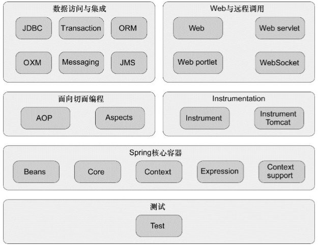

# Spring初步

Spring最根本的使命：简化Java开发，采用了如下策略：

- **基于POJO的轻量级和最小侵入性编程；**
- **通过依赖注入和面向接口实现松耦合；**
- **基于切面和惯例进行声明式编程；**
- **通过切面和模板减少样板代码；**

## Spring模块

- 容器是Spring框架最核心的部分，它管理着Spring应用中bean的创建、配置和管 理。
  - 在该模块中，包括了Spring bean工厂，它为Spring提供了DI的功能。基于 bean工厂，我们还会发现有多种Spring应用上下文的实现，每一种都提供了配置 Spring的不同方式。
  - 除了bean工厂和应用上下文，该模块也提供了许多企业服务，例如E-mail、JNDI访 问、EJB集成和调度。
- Spring的AOP模块：
  - 在AOP模块中，Spring对面向切面编程提供了丰富的支持。这个模块是Spring应用 系统中开发切面的基础。与DI一样，AOP可以帮助应用对象解耦。借助于AOP，可以 将遍布系统的关注点（例如事务和安全）从它们所应用的对象中解耦出来。
- Instrumentation：
  - Spring的Instrumentation模块提供了为JVM添加代理（agent）的功能。具体来讲，它为Tomcat提供了一个织入代理，能够为Tomcat传递类文件，就像这些文件是被类加载器加载的一样。
- 测试模块：
  - 通过该模块，你会发现Spring为使用JNDI、Servlet和Portlet编写单元测试提供了一系列的mock对象实现。对于集成测试，该模块为加载Spring应用上下文中的 bean集合以及与Spring上下文中的bean进行交互提供了支持。
- Spring Data
  - Spring Data使得在Spring中使用任何数据库都变得非常容易。尽管关系型数据库统治企业级应用多年，但是现代化的应用正在认识到并不是所有的数据都适合放在一张表中的行和列中。一种新的数据库种类，通常被称之为NoSQL数据库，提供了使用数据的新方法，这些方法会比传统的关系型数据库更为合适。
  - 不管你使用文档数据库，如MongoDB，图数据库，如Neo4j，还是传统的关系型数据 库，Spring Data都为持久化提供了一种简单的编程模型。这包括为多种数据库类 型提供了一种自动化的Repository机制，它负责为你创建Repository的实现
- Spring Batch
  - 当我们需要对数据进行大量操作时，没有任何技术可以比批处理更胜任这种场景。 如果需要开发一个批处理应用，你可以通过Spring Batch，使用Spring强大的面 向POJO的编程模型。
- Spring Integration
  - 许多企业级应用都需要与其他应用进行交互。Spring Integration提供了多种通用应用集成模式的Spring声明式风格实现。