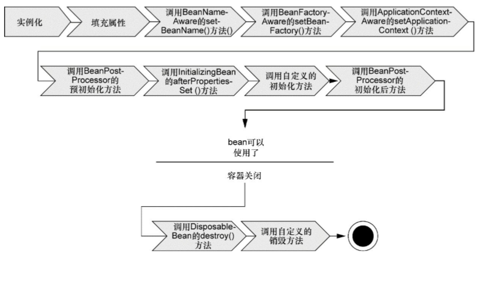

# Spring容器

在基于Spring的应用中，我们的应用对象生存于Spring容器中。Spring容器负责创建对象，装配它们，配置它们并管理它们的整个生命 周期，从生存到死亡（在这里，可能就是new到finalize()）。

容器是Spring框架的核心。Spring容器使用DI管理构成应用的组件，它会创建相互协作的组件之间的关联。毫无疑问，这些对象更简单干净，更易于理解，更易于重用并且更易于进行单元测试。

Spring容器并不是只有一个。Spring自带了多个容器实现，可以归为两种不同的类型：

- bean工厂（由org.springframework. beans. factory.beanFactory接口定义）是最简单的容器，提供基本的DI支持。
- 应用上下文 （由org.springframework.context.ApplicationContext接口定义）基于BeanFactory构 建，并提供应用框架级别的服务，例如从属性文件解析文本信息以及发布应用事件 给感兴趣的事件监听者。

### 应用上下文

常见的应用上下文：

- AnnotationConfigApplicationContext：从一个或多个基于Java的配置类中加载 Spring应用上下文； 
- AnnotationConfigWebApplicationContext：从一个或多个基于Java的配置类中加载 Spring Web应用上下文；
- ClassPathXmlApplicationContext：从类路径下的一个或多个XML配置文件中加载上下文定义，把应用上下文的定义文件作为类资源；
- FileSystemXmlapplicationcontext：从文件系统下的一个或多个XML配置文件中加载上下文定义；
- XmlWebApplicationContext：从Web应用下的一个或多个XML配置文件中加载上下文定义。

#### 加载应用程序上下文

ClassPathXmlApplicationContext/FileSystemXmlapplicationcontext：

- 无论是从文件系统中装载应用上下文还是从类路径下装载应用上下文，将bean加载 到bean工厂的过程都是相似的；

  ```java
  ApplicationContext context=new ClassPathXmlApplicationContext("config.xml");
  ApplicationContext context=new FileSystemXmlApplicationContext("D:/config.xml");
  ```

- FileSystemXmlApplicationContext在指定的文件系统路径下查找config.xml文 件；而ClassPathXmlApplicationContext是在所有的类路径（包含JAR文件）下查找config.xml文件。

AnnotationConfigApplicationContext：从Java配置中加载应用程序上下文。

```java
// 通过配置类Config加载bean
ApplicationContext applicationContext=new AnnotationConfigApplicationContext(Config.class);
```

#### 获取使用Bean

应用上下文准备就绪之后，我们就可以调用上下文的getBean()方法从Spring容器中 获取bean。

### Bean

#### bean生命周期

传统Java应用：使用Java关键字new进行bean实例化，然后该bean就可以使用了。一旦该bean不再被使用，则由Java自动进行垃圾回收。

Spring中的bean生命周期：



1. Spring对bean进行实例化；
2. Spring将值和bean的引用注入到bean对应的属性中；
3. 如果bean实现了BeanNameAware接口，Spring将bean的ID传递给setBeanName()方 法；
4. 如果bean实现了BeanFactoryAware接口，Spring将调用setBeanFactory()方法，将 BeanFactory容器实例传入；
5. 如果bean实现了ApplicationContextAware接口，Spring将调用setApplicationContext()方法，将bean所在的应用上下文的引用传入进来；
6. 如果bean实现了BeanPostProcessor接口，Spring将调用它们的postProcessBeforeInitialization()方法；
7. 如果bean实现了InitializingBean接口，Spring将调用它们的afterPropertiesSet()方法。类似地，如果bean使用init-method声明了初始化方法，该方法也会被调用；
8. 如果bean实现了BeanPostProcessor接口，Spring将调用它们的postProcessAfterInitialization()方法；
9. 此时，bean已经准备就绪，可以被应用程序使用了，它们将一直驻留在应用上下文中，直到该应用上下文被销毁；
10. 如果bean实现了DisposableBean接口，Spring将调用它的destroy()接口方法。同样，如果bean使用destroy-method声明了销毁方法，该方法也会被调用。


